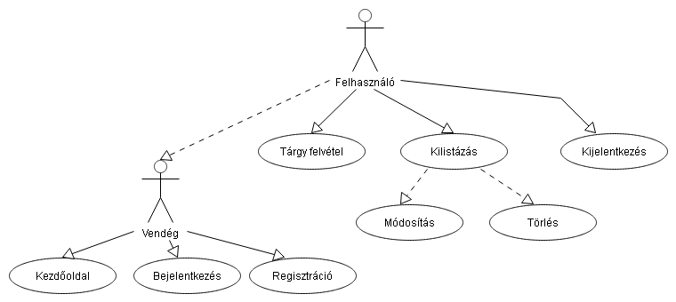
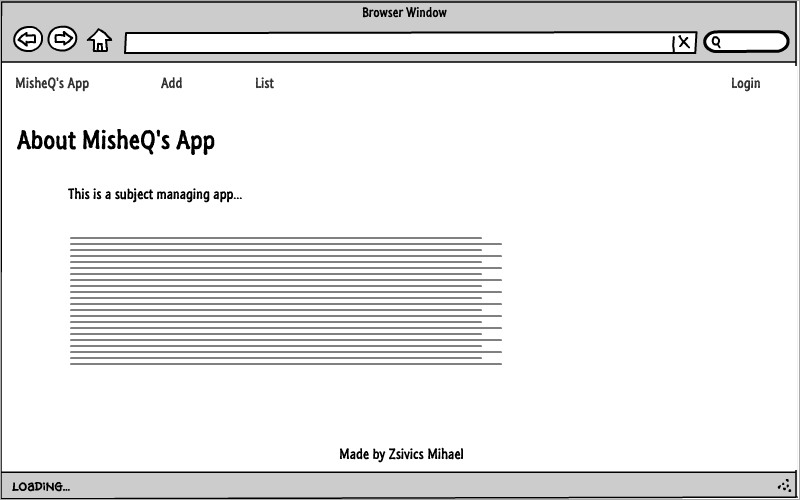
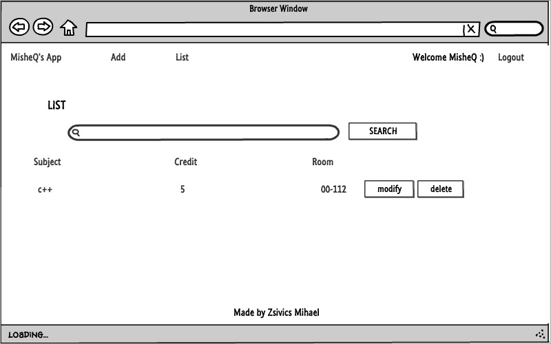
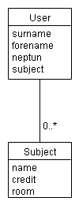
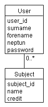
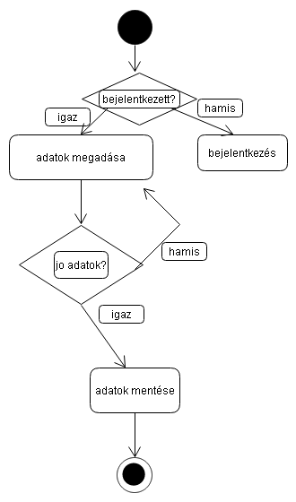

# Követelményanalízis

## Funkcionális követelmények

Megvalósítani egy tantárgyak felvételére, kezelésére szolgáló webes
technológiákkal fejlesztett alkalmazást. Elvárt követelmények aminek
tartalmaznia kell:

* legalább két modellt, egy-sok kapcsolatban
* legalább 1 űrlapot
* legalább 1 listázó oldalt
* legyen lehetőség új felvételére
* legyen lehetőség meglévő szerkesztésére
* legyen lehetőség meglévő törlésére
* legyenek benne csak hitelesítés után elérhető funkciók
* perzisztálás fájlba történjen
* közzététel Herokun

## Nem funkcionális követelmények

* Felhaszánálóbarát, stylusos kinézettel
* Felhasználók tárolása és szétválasztása
* A weboldal bővitése egyszerű legyen

## Szerepkörök

* __vendég:__ csak a főoldal tartalmához fér hozzá,
illetve a bejelentkező oldalt láthatja és tud regisztrálni
* __felhasználó:__ a vendég lehetőségein kívül, a felhasználó
fel tud venni új tárgyakat, azokat ki tudja listázni, módosítani illetve törölni.

## Használateseti-modell

## Folyamatok meghatározása

# Tervezés

## Oldaltérkép

Publikus:

- Főoldal
- Bejelentkezés
- Regisztráció

Regisztrált felhasználó

- Főoldal
- Bejelentkezés
- Regisztráció
- Tárgyfelvétel
- Tárgy listázás
- Tárgy módosítás
- Tárgy törlése
- Kijelentkezés

## Végpontok

* GET /: főoldal
* GET /auth/login: bejelentekzési oldal
* POST /auth/login: bejelentkező adatok küldése
* GET /auth/signup: regisztrációs oldal
* POST /auth/signup: regisztrációs adatok küldése
* GET /list: tárgy listázó oldal
* GET /delete:id : tárgy törlése
* GET /modify:id : tágy módosító oldal
* POST /modify:id : modosítot adatok küldése
* GET /add: tágy felvételi oldal
* POST /add: felvet tárgy adatai küldése
* GET /auth/logout: login oldal

## Oldalvázlatok

Főoldal

Tárgy felvétele

## Adatmodell

## Adatbázisterv

Adattáblák szöveges leírása:

    Név: user
    Más néven: felhasználó
    Leírás: a felhasználóhoz tartozó adatok ebben táblában vannak
    Attributumok:
        - id(egész): felhasználó egyedi azonosítója
        - surname(szöveg): a felhasználó vezetékneve
        - forename(szöveg): a felhasználó keresztneve
        - neptun(szöveg): a felhasználó neptun kódja
    Kapcsolatok:
    
    Név: subject
    Más néven: tárgy, tantárgy
    Leírás: tantárgyak adatai ebben a táblában vannak
    Attributumok:
        - id(egész): tágy egyedi azonosítója
        - targy(szöveg): a tárgy neve
        - kredit(egész): a tárgy kredit mennyisége
        - terem(szöveg): a tárgy teremje
    Kapcsolatok: tantárgy kapcsolása a felhasznalóhoz

## Állapotdiagramm

Új tantárgy felvételének folyamata

# Felhasználói dokumentáció

## Implementáció

Az alkalmazás a Cloud9 webes fejlesztői környezetben lett megírva

## Könyvtárstruktúra
    
    ./docs: tartlamazza a dokumentációhoz szükséges fájlokat
    ./models: adatmodelleket tartalmazza (user.js, subject.js)
    ./views: a megjelenítéshez szükséges .hbs kiterjesztésü fájlok
    ./views/auth: a bejelentekzési oldalak
    ./views/partials: menü elemeinek részei
    
##Futtatás

Az alkalmazás futtatásához a elegendo 512mb ram, 1gb merevlemez terulet meg egy dual core processzor vagy ennél jobb.
Futtatáshoz szükségünk van egy keretrendszerre, ami ellátja az alkalmazást a megfelelő segédkönyvtárokkal. Ilyenek a Cloud9, a Heroku.

##Telepítés

A telepítés az állományok letöltésével kezdődik. Miután kicsomagoltuk, fel kell töltenünk a keretrendszerbe. Végül az npm install parancs kiadásával a terminálban, a program feltelepíti a szükséges könyvtárakat.

##A program használata

A program elindításához a node index parancs kiadása szükséges, illetve ellenőriznünk kell még, hogy a program gyökérkönyvtárában áll-e a prompt. Amennyiben nem ezt módosítanunk kell. Ezután a program használatra kész.
    
    
    
    
    
    
    

